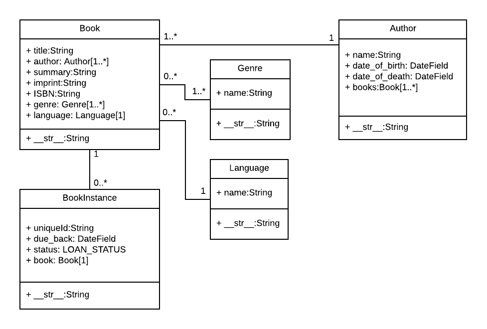

# Mozilla Tutorial

## Django Learning Project

## ERD of Models

## Update SITE_AUTHOR
Goto settings.py and update SITE_AUTHOR as needed

## Create and Activate a Virtual Environment for the project (Linux and Mac)  
`$: python3 -m venv _env`  
`$: source _env/bin/activate`  
`$: pip install --upgrade pip`  
 
## Install Django and related packages   
`$: pip install -r requirements.txt`    

## Run Migrations  
`$: python manage.py migrate catalog`  
`$: python manage.py migrate` 
